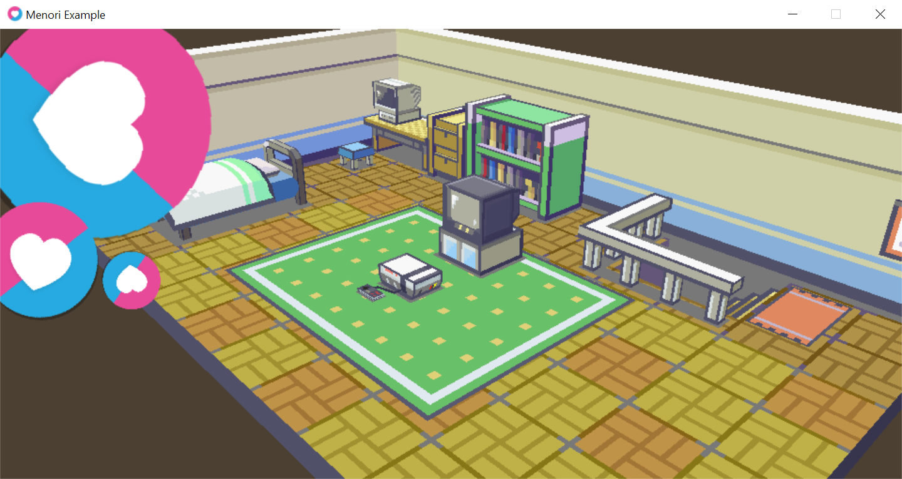

# Menori

LÖVE library for 3D rendering based on scene graph. Support glTF 2.0 (implemented: meshes, materials, textures, skins, skeletons, animations). Assets may be provided either in JSON (.gltf) or binary (.glb) format.

Works on LÖVE 11.4 and higher.



[Documentation](https://rozenmad.github.io)

You can generate documentation using `ldoc -c menori/docs/config.ld -o index .`

# Usage Example

``` lua
local menori = require 'menori'

local ml = menori.ml
local vec3 = ml.vec3
local quat = ml.quat

function love.load()
	local _, _, w, h = menori.app:get_viewport()
	camera = menori.PerspectiveCamera(60, w/h, 0.5, 1024)
	environment = menori.Environment(camera)

	root_node = menori.Node()

	local gltf = menori.glTFLoader.load('example_assets/etrian_odyssey_3_monk/scene.gltf')
	local scenes = menori.NodeTreeBuilder.create(gltf, function (scene, builder)
		animations = menori.glTFAnimations(builder.animations)
		animations:set_action(1)

		scene:traverse(function (node)
			if node.mesh then
				node.material:set("baseColor", {0.85, 0.95, 1.0, 1})
			end
		end)
      end)

	root_node:attach(scenes[1])
end

local scene = menori.Scene()

function love.draw()
	love.graphics.clear(0.3, 0.25, 0.2)
	scene:render_nodes(root_node, environment, {
		node_sort_comp = menori.Scene.alpha_mode_comp
	})

      love.graphics.print(love.timer.getFPS(), 10, 10)
end

function love.update(dt)
	scene:update_nodes(root_node, environment)

	local q = quat.from_euler_angles(0, math.rad(20), math.rad(10)) * vec3.unit_z * 2.0
	local v = vec3(0, 0.5, 0)
	camera.center = v
	camera.eye = q + v
	camera:update_view_matrix()

	animations:update(dt)

	if love.keyboard.isDown('escape') then
		love.event.quit()
	end
end
```

See ```main.lua``` for a more complete example.

# License
MIT